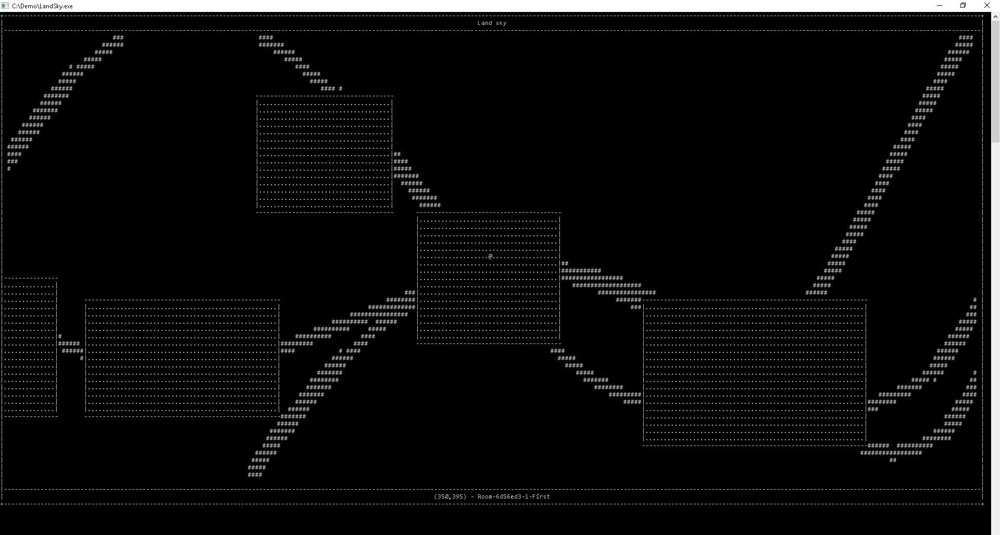

<h1 align="center"> Land sky </h1>

<h2 align="center">Roguelike NetHacklike multiplayer game</h4>

Land sky project is an attempt at building a multiplayer version of roguelike nethacklike game.

[](https://travis-ci.org/branc116/LandSky)

#### Goal include:
* ***It should be multiplayer***
* ***It should be sandbox***
* ***It should be open source***
* ***It should be fun as original game was***
* ***It should be written in statically typed language***. 
Reason for this is that is easier for new developers to get into, I choose C#.

#### Get started:
* ``` >git clone https://github.com/branc116/LandSky ```
* ***Windows***: 
 * Just install [Visual studio](https://www.visualstudio.com/en-us/products/visual-studio-community-vs.aspx) 
 * open src/LandSky.sln  
 * Build and/or start hacking
 * Start it inside Visual studio or run ``` src/core/bin/Debug/LandSky.exe ```
* ***Linux and OS X (Maybe, most likely will not work, but I'll try to make it work)***
 * Hack with your favorite C# IDE
 * Install [Mono](http://www.mono-project.com/download/)
 * ``` >xbuild src/LandSky.sln ```
 * ``` >mono src/core/bin/Debug/LandSky.exe ```

#### Design decisions
Here are some of the design decisions:
* ***Add as many comments as possible***. Just so that other people can jump in code and see what you've done.
* ***Don't write you name on top of every file you make***. This is team effort, not a competition.
* ***Naming convention***: Namespaces - PascalCase, classes - PascalCase, public properies - PascalCase, private properies - mPascalCase, other stuff is not really important
* ***JSON***. Whenever you have to serialize object to save it, send it, ... use JSON

#### Current state
This project is in a very early stage and needs a lot of work. Everything that works should be more optimised.

What works:
* Room generation
* Path generating
* Controls
* Rendering
* Maybe someting else...

#### TODO list
This is the list of stuff that need to be made. I'm always open to suggestions if you have an idea.
- [ ] Implement real time database for multyplayer stuff
- [ ] Implement sql or nosql database for saving player status and game states
- [ ] Implement more screens
- [ ] Make the drawing process faster
- [ ] Make gameplay features
- [ ] A lot more

#### Demo


#### Main author
* Branimir Ričko
* Mail: rickobranimir@gmail.com
 
#### Licence
This project is licensed under [Apache License Version 2.0](LICENSE.md)
