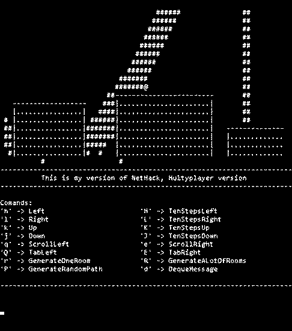

<h1 align="center"> MultyNetHack </h1>

<h2 align="center">A remake of the Nethack.</h4>

MultyNetHack project is an attempt at building multiplayer version of the clasic game Nethack.

#### Goal include:
* ***It shuld be multiplayer***
* ***It shuld be sandbox***
* ***It shuld be open source***
* ***It shuld be fun as original game was***
* ***It shuld be written in statically typed language***. 
Reason for this is that is easier for new developers to get into.I choose C#.

#### Get started:
* \>git clone https://github.com/branc116/MultyNetHack
* ***Windows***: 
* * Just install [Visual studio](https://www.visualstudio.com/en-us/products/visual-studio-community-vs.aspx) 
* * open MultyNetHack/MultyNetHack.sln  
* * Build and/or start hacking
* ***Linux and OS X (Maybe, maybe most likely will not work, but I'll try to make it work)***
* * Hack with your favorite C# IDE
* * Install [Mono](http://www.mono-project.com/download/)
* * \>xbuild MultyNetHack/MultyNetHack.sln

#### Design decisions
Here are some of the design decisions:
* ***Add as many comments as possible***. Just so that other people can jump in code and see what you've done.
* ***Don't write you name on top of every file you make***. This is team effort, not a competition.
* ***Naming convention***: Namespaces - CamelCase, classes - CamelCase, public properies - CamelCase, private properies - mCamelCase, other stuff is not really important
* ***JSON***. Whenever you have to serialize object to save it, send it, ... use JSON

#### Current state
This project is in a very early stage and needs a lot of work. Everything that works should be more optimised.

What works:
* Room generation
* Path generating
* Controls
* Rendering
* Maybe someting else...

#### TODO list
This is the list of stuff that need to be made. I'm always open to suggestions if you have an idea.
* Implement real time database for multyplayer stuff
* Implement sql or nosql database for saveing played status and game states
* Implement more screens
* Make the drowing process faster
* Make gameplay features
* A lot more

#### Demo

#### Main author
* Branimir Ričko
* Mail: rickobranimir@gmail.com
 
#### Licence
This project is licensed under [Apache License Version 2.0](LICENSE.md)
